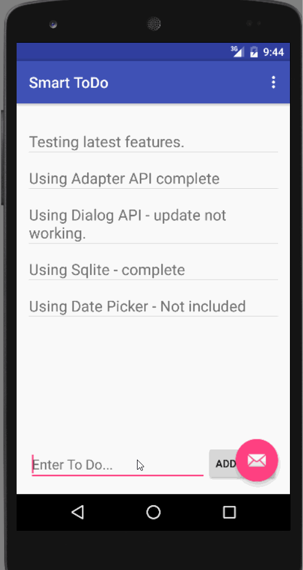

Smart Todo - Android App Demo

This application is created to manage todo actions and suppors the below mentioned features:

 * [x] Suggested: Persist the todo items into SQLite instead of a text file - complete.
 * [x] Suggested: Improve style of the todo items in the list using a custom adapter - complete.
 * [x] Suggested: Add support for completion due dates for todo items - Not complete.
 * [x] Suggested: Use a DialogFragment instead of new Activity for editing items - Dialog is working when I click on submit in dialog it is not navigating and refresh parent activity.
	
Walk through of the functionality:

